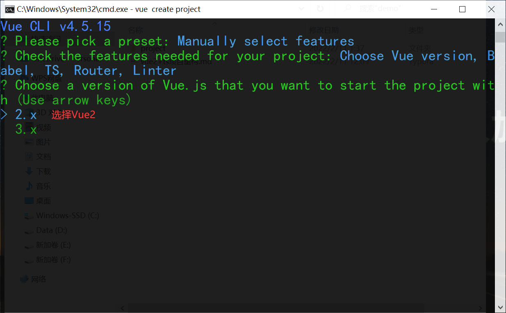

#### 1、创建项目
```cmd
vue create project
```





#### 2、安装项目所需第三方依赖
```cmd
cnpm i element-ui font-awesome axios echarts@4 -S
```

#### 3、设置vue.config.js
把老项目中的vue.config.js文件复制过来,再添加ts文件匹配
```js
// 添加ts文件匹配
chainWebpack(chainableWebpack) {
  chainableWebpack.resovle = { extensions:['.js','.ts','.json','.d.ts']}
}
```

#### 4、main.ts
把main.js中的内容复制过来,会出现一些红色波浪线
把service.js文件复制过来,把utils文件夹复制过来,把App.vue复制文件过来

#### 5、解决main.ts的echarts和service引入问题
在shims-vue.d.ts中加入 declare module 'echarts'
在shims-vue.d.ts中加入 declare module '*.js'

#### 6、把assets、plugins、components文件夹复制过来

#### 7、改写router文件夹中的js文件为ts文件,删除view文件夹
router文件夹中index.ts声明RouterConfig类型
```js
import Vue from "vue"
import Router, { RouteConfig } from "vue-router"

const routes: Array<RouteConfig> = [] =  [
  {
    path: '/',
    redirect: '/login',
    meta:{
      hidden: true
    }
  },
  //  ...其他路由
]

Vue.use(Router)

const router = new Router({
  mode: "history",
  routes,
})

export default router
```

```js
// 处理路由中的参数
meta:{
iconClass:xxx,
hidden:xxx
}
```

#### 8、把api文件夹复制过来
把api.js改写成api.ts,新建types.d.ts类型描述文件去写定义接口
* 声明IUserData接口类型
```js
export interface IUserData {
  username: string;
  password: string;
}
```

#### 9、引入types,对login约束
```js
import {IUserData} from '../types'

// 登录接口
export function login(data:IUserData) {
    return service({
        method: 'post',
        url: '/login',
        data
    })
}
```

#### 10、改写Login.vue文件
```js
// step5
import { IUserData } from "@/types";
import Component from "vue-class-component";
import Vue from "vue";
@Component
export default class extends Vue {
  name = "Login";
  form: IUserData = {
    username: "",
    password: "",
  };
  rules = {
    username: [{ validator: nameRule, trigger: "blur" }],
    password: [{ validator: passRule, trigger: "blur" }],
  };

  // step1
  login(form: any) {
    // step2                       // step3
    (this.$refs[form] as any).validate((valid: any) => {
      if (valid) {
        console.log("test1", this);

        // step4
        login(this.form).then((res: any) => {
          // this.axios.post('http://localhost:3000/login' ,this.form).then((res) => {
          console.log(res);
          if (res.data.status === 200) {
            setToken("username", res.data.username);
            setToken("token", res.data.token);
            this.$message({ message: res.data.message, type: "success" });
            this.$router.push("/home");
          }
        });
      } else {
        console.log("test2", this);
        console.error(this.form);
      }
    });
  }
}
```

#### 11、Login.vue文件报错
我们使用@Component装饰器会报错,因为这是一个实验特性,所以我们需要在tsconfig.json文件中添加"experimentalDecorators": true,这个配置,然后重启项目,就不会再报错了。

#### 12、关闭eslint检测
在vue.config.js文件中添加如下配置即可
```js
lintOnSave: false,
```